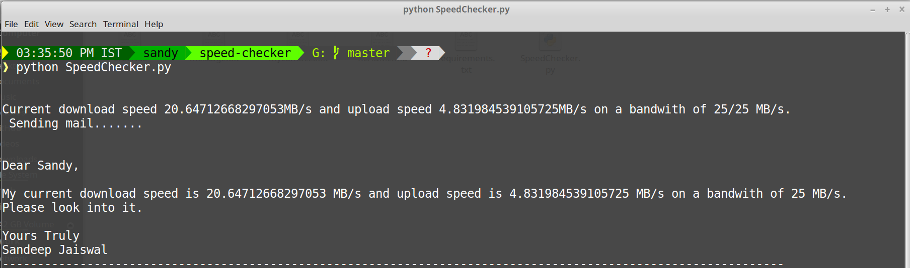

# Speed Checker
#### Sends a mail to my ISP when my download/upload speeds aren't as per my bandwith

***

## How to run SpeedChecker.py

1. Clone this repository.
	`$ git clone https://github.com/sandyjswl/speed-checker.git`
or download as a ZIP.

2. Open a terminal window in the location you cloned/extracted the repository to and install the modules in `requirements.txt`.
	`pip install -U -r requirements.txt`

3. Open `InternetSpeedNagger.py` and edit lines 13 and 14 with your OUTLOOK email-id and password.
4. Change `mycontacts.txt` to add the name of your ISP and the email-id.
5. (optional) Change the message in `message.txt` to suit your needs.
6. Change other information you deem necessary.

*** 

## In-Action

